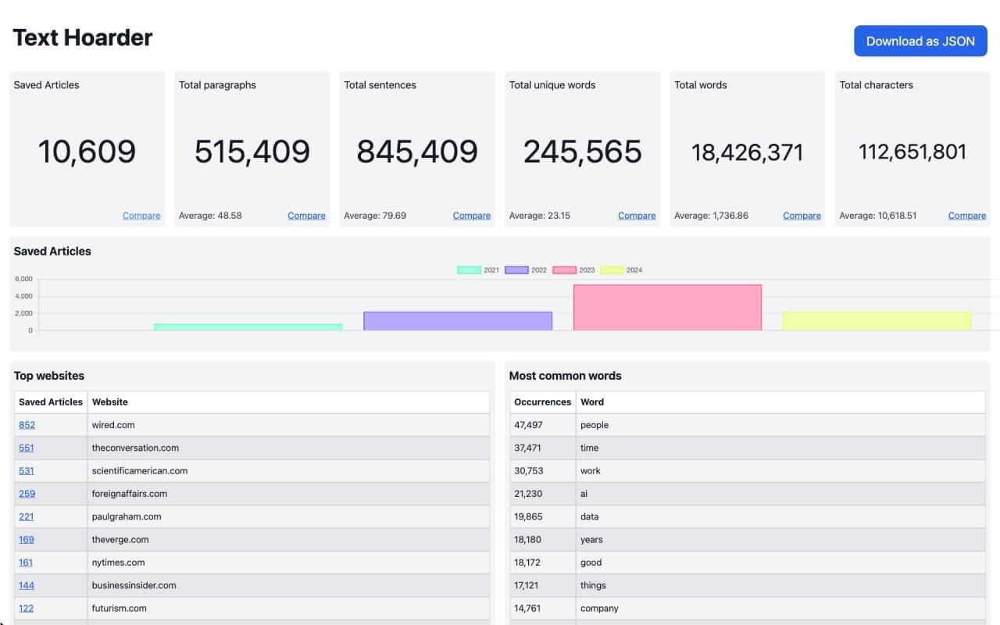
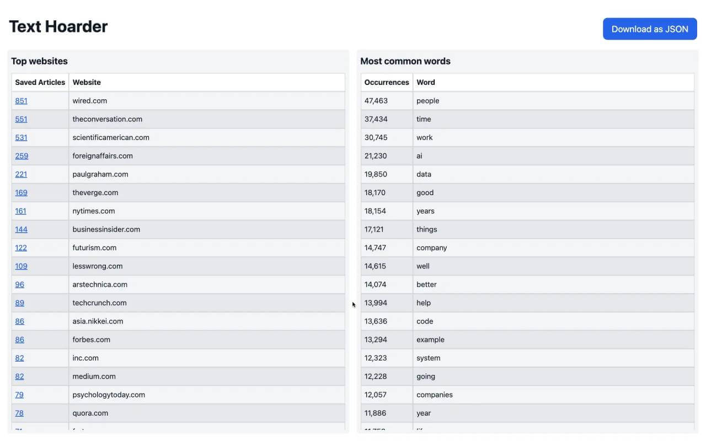

# Text Hoarder

[A browser extension for Google Chrome](https://chromewebstore.google.com/u/1/detail/bjknebjiadgjchmhppdfdiddfegmcaao)
that provides reader view, saving articles for later, and generation of stats of
your reading habits.

Features:

- Customizable reader mode
  - Bypass flashing ads, distracting elements, scrolljacking and other
    inconveniences of modern day web browsing
  - Improve accessibility & usability of any webpage
  - Automatically enter reader mode for configured webpages
  - Download simplified page as HTML, markdown or plain text
  - Print simplified page or convert it to PDF using browser's print dialog
- Save articles to a private GitHub repository as Markdown files
  - Generate stats based on saved articles to see your reading habits (most
    common websites, popular topics, count of articles saved per year)
  - Cleanup saved articles for use with any text-to-speech software

[Add to Chrome](https://chromewebstore.google.com/u/1/detail/bjknebjiadgjchmhppdfdiddfegmcaao)

Reader mode:

Extensive settings:

Save to GitHub:

Powerful stats:

Your common sources and topics:

---

[Report a Bug / Feature Request](https://github.com/maxpatiiuk/text-hoarder/issues/new/choose)

Note, to experience all features, you need to create a GitHub repository for
Text Hoarder to use as storage.

To see stats of your saved articles, you need to install a command line utility.
[See instructions](./docs/cli.md).

If you prefer a less technical experience, I would recommend
[GoodLinks](https://goodlinks.app/) as a more beginner-friendly alternative to
this extension.
