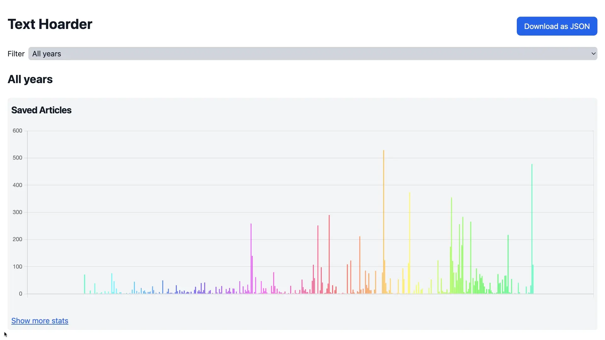

# Text Hoarder CLI Docs

Text Hoarder browser extension comes with an optional command line companion
program.

The companion has the following powerful features:

- [Generate comprehensive statistics about your saved articles](#generating-stats)
- [Optimize saved articles for text-to-speech software](#processing-text)
- [Automatically exclude unwanted content and advertisements from saved articles](#finding-spam-lines)

## Getting started

As a pre-requisite, you should have
[Node.js installed](https://nodejs.org/en/download)

```sh
# Replace YOUR_USERNAME with your GitHub username.
# Replace YOUR_TEXT_HOARDER_REPOSITORY with the name of the repository you
# created to store Text Hoarder's saved articles
git clone https://github.com/YOUR_USERNAME/YOUR_TEXT_HOARDER_REPOSITORY
cd YOUR_TEXT_HOARDER_REPOSITORY
# Installs Text Hoarder CLI companion
npm install
# Shows documentation for Text Hoarder CLI companion
npx text-hoarder --help
```

If you need help cloning the repository from the command line, see
[documentation from GitHub](https://docs.github.com/en/repositories/creating-and-managing-repositories/cloning-a-repository)

> If you are a Windows user, consider running this command in your terminal to
> allow Git to handle files with long file names.
>
> ```sh
> git config --global core.longpaths true
> ```
>
> Without this, "git clone" may fail if your text hoarder repository saved
> articles with very long URLs

## Generating Stats

You can create a webpage with comprehensive statistics about the saved articles
using the `npx text-hoarder stats` command.

### Example Usage

```sh
# Open the repository you created to store Text Hoarder's saved articles
cd YOUR_TEXT_HOARDER_REPOSITORY
# Generate stats based on all saved articles and open results in your browser.
# To see all options, run "npx text-hoarder stats --help"
npx text-hoarder stats
```

### Example output:

```
Computing statistics...
1%
... trimmed ...
99%
100%
Finalizing output...
```

Once complete, stats.html will open in your browser:




## Processing Text

`npx text-hoarder process` command optimizes saved articles for text-to-speech
software (removes likely spam and advertisement lines, removes characters that
are not friendly with text-to-speech software, and etc).

This command also converts markdown files to plaintext and splits large articles
into smaller files to work around the max length limit in some text-to-speech
tools.

By default, it processes all new articles saved since the last time this command
was run.

### Example Usage

```sh
# Open the repository you created to store Text Hoarder's saved articles
cd YOUR_TEXT_HOARDER_REPOSITORY
# Process all articles saved since the last time this command was run.
# To see all options, run "npx text-hoarder process --help"
npx text-hoarder process
```

By default, `process` automatically removes duplicated lines between saved
articles. Why this is useful:

- If you accidentally saved the same article twice, this step will remove the
  duplicate
- It will automatically remove all the commonly repeated lines like
  `Advertisement`, or footers from websites (i.e, wired.com has a lot of lines
  like `More Great WIRED Stories` at the end of each article)
- Some websites are not fully accessibility-complaint, leading to tools like
  Text Hoarder extracting some line two times in a row. This step will remove
  the duplicates.

If you wish to disable this, pass the `--no-exclude-duplicated-lines` option
when running the command.

### Converting Processed Text to Audio

The output of the `npx text-hoarder process` command can be used with various
text-to-speech software. This is a great way of consuming the saved articles
while doing other tasks, like walking or doing house chores.

Here is a small example script for converting the processed text files to audio
using macOS's "say" utility:

```sh
# Find the directory where process outputted the files
cd processed/ && ls
# Open the directory where the processed text files are located
cd 2024-02-18
# Convert each text file that hasn't yet been converted
for f in *.txt; do
  echo "Generating $f.flac"
  # -r controls speaking rate. Run "man say" to see all options
  say -r 100 -o "$f.flac" --progress "$(cat $f)"
  # NOTE: this deletes the processed text file after it's converted to audio
  rm "$f"
done
```

> NOTE: the above script removes the processed text file after converting it to
> audio. This allows to mark current progress and makes restarting the command
> easy if it freezes. If you do not wish this, remove the `rm "$f"` line.

> If you are not on macOS, see some of the
> [options for other operating systems](https://stackoverflow.com/a/39647762/8584605)

For best results, you should download high-quality Siri's voices. See the
following section for more information.

<details>
<summary>(macOS) Get High-Quality Text-To-Speech Voices</summary>

On macOS, high-quality Siri's voices are available for text-to-speech using the
`say` CLI command, as well as using the
["Spoken Content"](https://support.apple.com/guide/mac-help/have-your-mac-speak-text-thats-on-the-screen-mh27448/mac)
accessibility feature.

To download these, follow
[Apple's tutorial on adding a new voice](https://support.apple.com/guide/mac-help/change-the-voice-your-mac-uses-to-speak-text-mchlp2290/mac#:~:text=and%20speaking%20rate.-,Add%20a%20new%20voice,-You%20can%20add).
In the list of voices, search for a section titled "English (US) - Siri" (or
other language, as long as the name ends with "Siri") - these are the highest
quality voices available.

After downloading, make sure to
[select it as the default voice](https://support.apple.com/guide/mac-help/change-the-voice-your-mac-uses-to-speak-text-mchlp2290/mac#:~:text=in%20alert%20messages.-,Choose%20a%20voice,-On%20your%20Mac).

Now, when you use the `say` CLI command, the high-quality voice will be used.

</details>

## Finding spam lines

`npx text-hoarder find-spam` finds commonly repeated lines in your saved
articles, which are possible spam/advertisement lines that should be excluded
(for example, lines like `Advertisement`, `RECOMMENDED VIDEOS FOR YOU`, etc.).

## Example usage

You can run the `find-spam` command, then check if it reported any common
undesirable lines of text, and add those to the `exclude-list.txt` file in the
repository Text Hoarder saves articles too.

```sh
# Open the repository you created to store Text Hoarder's saved articles
cd YOUR_TEXT_HOARDER_REPOSITORY
# Report possible unwanted lines
# To see all options, run "npx text-hoarder find-spam --help"
npx text-hoarder find-spam
# Add detected spam lines to the exclude-list.txt file
```

Next time you run `npx text-hoarder process` or `npx text-hoarder find-spam`,
the unwanted lines would be excluded automatically.

By default, text-hoarder's CLI comes with a list of common spam lines built in.
See the [full list](../packages/cli/src/components/Spam/exclude-list.txt). If
you do not wish to use this list, pass the `--no-default-exclude` option when
running the commands.
